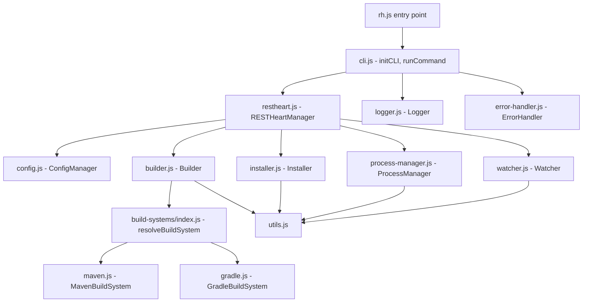
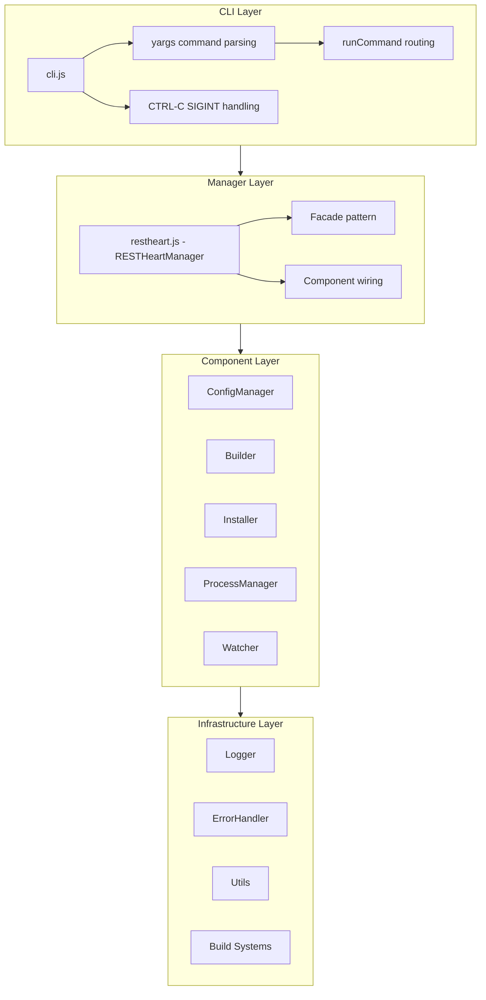
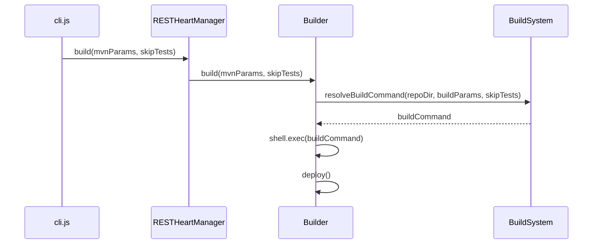
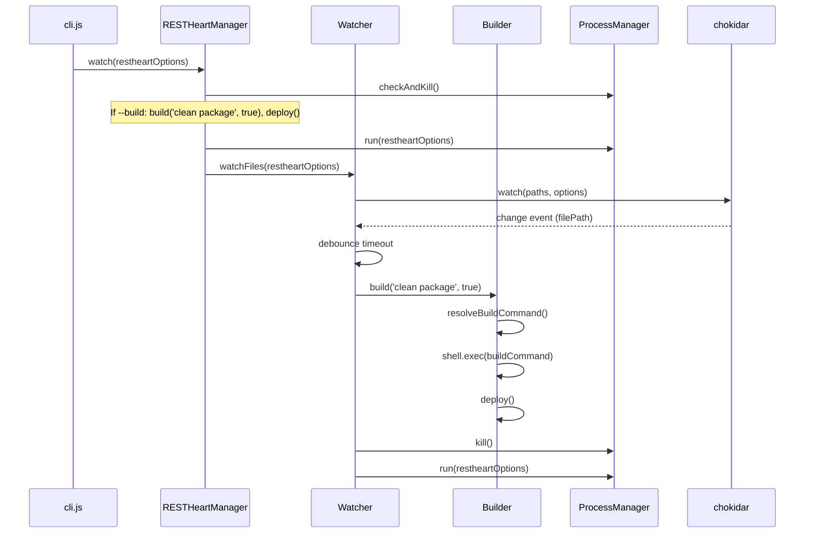
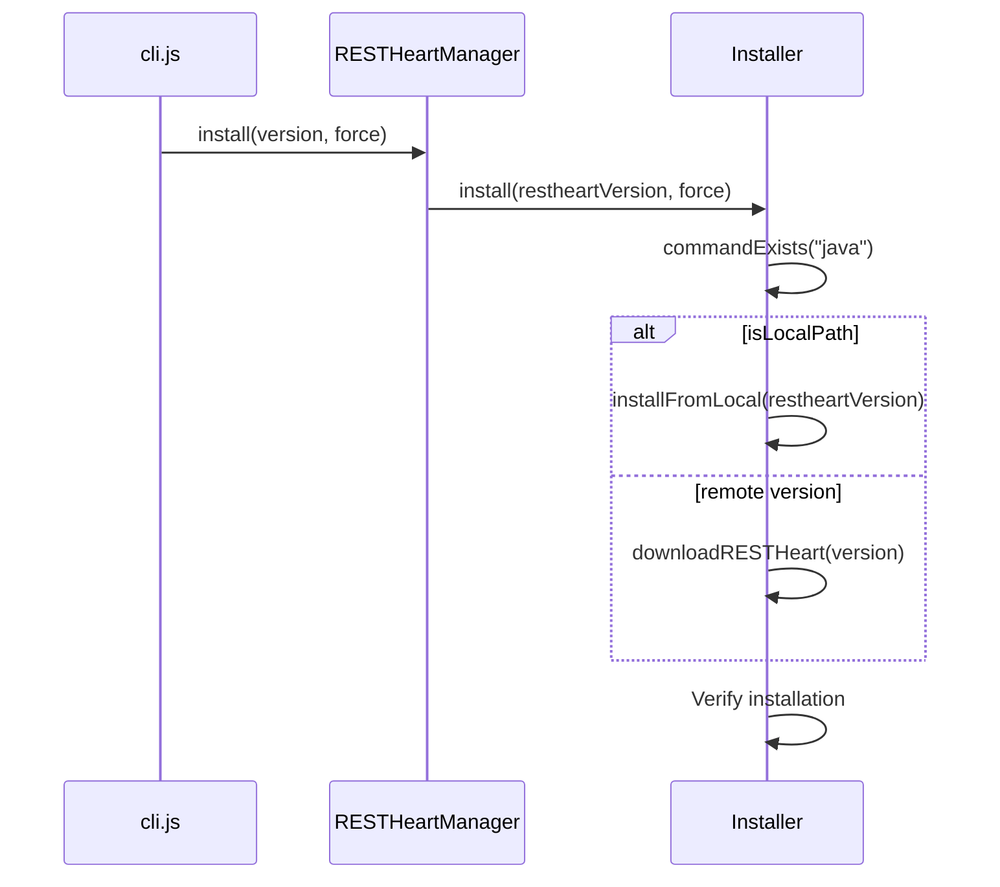
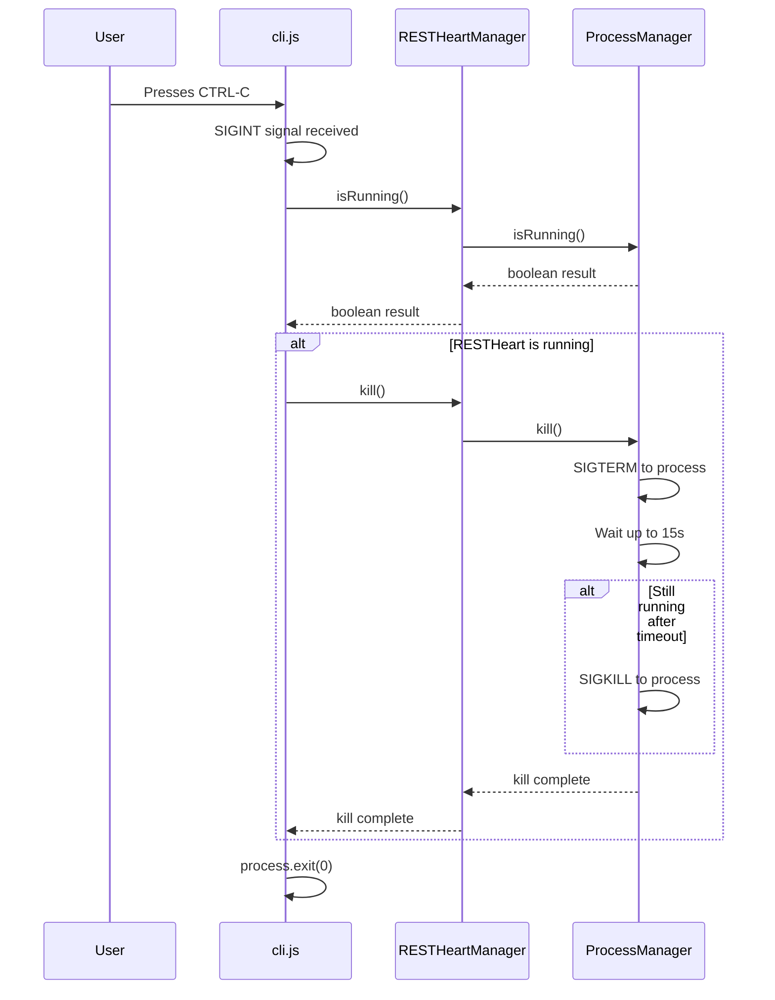

# RESTHeart CLI Architecture Overview

This document describes the technical architecture of RESTHeart CLI, explaining how the components work together to provide a streamlined development experience.

## High-Level Architecture

RESTHeart CLI follows a layered architecture with clear separation of concerns:



*Component dependency graph showing how the CLI entry point flows through the orchestration layer to individual components.*



*Layered architecture: CLI parses commands and delegates to RESTHeartManager, which orchestrates components that rely on shared infrastructure services.*

## Component Responsibilities

### CLI Layer (`lib/cli.js`)

The entry point for user interaction. Responsibilities:

- **Command Parsing**: Uses yargs to parse command-line arguments and options
- **Command Routing**: Routes commands to appropriate manager methods via `runCommand` switch statement
- **User Feedback**: Displays welcome messages and handles CTRL-C gracefully
- **Option Validation**: Validates global and command-specific options
- **SIGINT Handling**: Intercepts CTRL-C and kills RESTHeart process before exiting
- **RESTHeart Options Forwarding**: Uses `populate--` to capture options after `--` separator

**Command Registration Pattern**:

The CLI uses yargs with strict mode and `populate--` configuration to register commands:

```javascript
yargs(hideBin(process.argv))
    .strict()
    .parserConfiguration({ 'populate--': true })
    .command(['install [restheart-version]', 'i'], description, builderFn, handlerFn)
    .command(['build', 'b'], description, builderFn, handlerFn)
    .command(['run [restheart-options..]', 'r'], description, builderFn, handlerFn)
    // ... more commands
    .middleware([/* global middleware for logger config */])
    .parse()
```

**RESTHeart Options Forwarding**:

The `populate--` configuration captures all arguments after the `--` separator into `argv['--']` array. The `runCommand` function joins these into a space-separated string and passes them to RESTHeart:

```javascript
const restheartOptions = argv['--']?.join(' ') || ''
```

This allows users to pass RESTHeart-specific options directly:

```bash
rh run -- -o /path/to/config.yml -s
```

**CTRL-C Handling**:

The CLI intercepts `SIGINT` signals to ensure clean shutdown:

```javascript
process.on('SIGINT', async () => {
    try {
        if (await rh.isRunning()) {
            await rh.kill()
        }
    } catch (error) {
        logger.error(`Error during shutdown: ${error.message}`)
    }
    process.exit(0)
})
```

**Key Design Decisions**:
- Implements strict mode for command validation
- Handles uncaught exceptions and unhandled rejections globally via `ErrorHandler.handleError`
- Uses yargs middleware to configure logger level based on `--verbose`/`--quiet`/`--debug` flags

### Manager Layer (`lib/restheart.js`)

The orchestration layer that coordinates all components. Responsibilities:

- **Component Initialization**: Creates and wires all component instances
- **Public API**: Exposes high-level methods for CLI commands
- **Configuration Management**: Delegates to ConfigManager
- **Lifecycle Management**: Handles startup, shutdown, and cleanup

**Facade Pattern**:

RESTHeartManager implements the facade pattern, providing a simplified interface to the complex subsystem of components. The constructor wires dependencies via dependency injection:

```javascript
constructor(httpPort, debugMode) {
    // Initialize configuration
    this.configManager = new ConfigManager({
        httpPort: httpPort || 8080,
        debugMode: debugMode || false,
    })

    // Initialize components with dependency injection
    this.builder = new Builder(this.configManager)
    this.processManager = new ProcessManager(this.configManager)
    this.installer = new Installer(this.configManager, this.builder)
    this.watcher = new Watcher(this.configManager, this.processManager, this.builder)
}
```

**Dependency Injection Pattern**:

Components receive their dependencies through constructor injection:
- `Builder` receives `ConfigManager`
- `ProcessManager` receives `ConfigManager`
- `Installer` receives `ConfigManager` and `Builder`
- `Watcher` receives `ConfigManager`, `ProcessManager`, and `Builder`

**Key Methods**:
- `install(version, force)`: Delegates to Installer
- `build(mvnParams, skipTests)`: Delegates to Builder
- `deploy()`: Delegates to Builder.deploy()
- `run(restheartOptions)`: Delegates to ProcessManager
- `watchFiles(restheartOptions)`: Delegates to Watcher
- `kill()`: Delegates to ProcessManager.kill()
- `status()`: Delegates to ProcessManager.status()
- `isRunning()`: Delegates to ProcessManager.isRunning()
- `checkAndKill()`: Delegates to ProcessManager.checkAndKill()
- `onlyPrintConfig(restheartOptions)`: Checks if options are config-print-only flags (`-t`, `-c`, `-v`)
- `printConfiguration()`: Logs all current config values
- `setHttpPort(port)`, `setDebugMode(debug)`, `setBuildSystem(buildSystem)`: Config setters

**Key Design Decisions**:
- Single responsibility: each component handles one domain
- Dependency injection: components receive ConfigManager in constructor
- Facade pattern: provides simplified interface to complex subsystems

### Component Layer

#### ConfigManager (`lib/config.js`)

Manages all configuration settings. Responsibilities:

- **Configuration Storage**: Maintains runtime configuration state
- **Validation**: Validates configuration values (ports, paths, etc.)
- **Directory Management**: Ensures cache directories exist
- **Default Values**: Provides sensible defaults for all settings

**Configuration Hierarchy**:
1. Command-line options (highest priority)
2. Environment variables
3. Default values (lowest priority)

**Key Settings**:
- `repoDir`: Current working directory (project root)
- `cacheDir`: `.cache` directory for RESTHeart installation
- `rhDir`: `.cache/restheart` - RESTHeart installation directory
- `httpPort`: HTTP port (default: 8080)
- `debugMode`: Debug output flag
- `buildSystem`: Build system preference (auto/maven/gradle)

#### Builder (`lib/builder.js`)

Handles building and deploying RESTHeart plugins. Responsibilities:

- **Build Execution**: Runs Maven or Gradle build commands (prefers wrapper scripts `mvnw`/`gradlew`)
- **Artifact Deployment**: Copies built JARs to RESTHeart plugins directory
- **Build System Resolution**: Determines which build system to use via `resolveBuildSystem`
- **Error Handling**: Deduplicates consecutive error output lines

**Key Design Decisions**:
- Delegates build system specifics to `build-systems/` module
- Cleans target directory before building
- Returns to original directory after build (even on failure)
- Uses silent shell execution with deduplicated error output
- Build params use Maven conventions (`clean package`); Gradle maps these via `mapBuildParams`

#### Installer (`lib/installer.js`)

Manages RESTHeart installation. Responsibilities:

- **Version Resolution**: Handles "latest", specific versions, and local paths
- **Download Management**: Downloads RESTHeart from GitHub releases using native Node.js HTTPS
- **Local Installation**: Installs from local RESTHeart build directories
- **Version Verification**: Checks existing installations, verifies via `java -jar ... -v`

**Installation Strategies**:
1. **Remote**: Downloads from GitHub releases (latest or specific version)
2. **Local**: Copies from local RESTHeart build directory (detected by `/` or `\` in the argument)

**Constructor Dependencies**:
- `ConfigManager`: For directory paths and settings
- `Builder`: Used for post-install build if needed

**Key Design Decisions**:
- Checks for Java installation before proceeding (via `commandExists`)
- Verifies existing installations to avoid redundant downloads
- Supports force reinstallation with `--force` flag (cleans cache directory)
- Uses native Node.js HTTPS for downloads (no external dependencies)

#### ProcessManager (`lib/process-manager.js`)

Manages RESTHeart process lifecycle. Responsibilities:

- **Process Execution**: Starts RESTHeart with configured options
- **Process Termination**: Kills running RESTHeart instances with SIGTERM/SIGKILL fallback
- **Port Management**: Checks port availability on both IPv4 (`127.0.0.1`) and IPv6 (`::1`)
- **Status Monitoring**: Checks if RESTHeart is running
- **Config Detection**: Parses `-o` flag from RESTHeart options to find YAML config for host/port

**Key Methods**:
- `run(restheartOptions)`: Starts RESTHeart as a background process
- `kill()`: Uses `lsof` for port-specific detection, falls back to `ps-list`; SIGTERM then SIGKILL after 15s timeout
- `isRunning()`: Checks both `httpPort` and `httpPort + 1000` (RESTHeart's MongoDB wire protocol port)
- `status()`: Logs whether RESTHeart is running at the configured port
- `checkAndKill()`: Conditionally kills if already running
- `onlyPrintConfig(restheartOptions)`: Returns `true` when options contain `-t`, `-c`, or `-v` (RESTHeart print/config flags)

**Key Design Decisions**:
- Prefers `lsof` for port-specific process detection
- Falls back to `ps-list` for process discovery
- Parses RESTHeart YAML config for host/port settings
- Captures RHO environment variable at startup (`originalRHO`) to prevent duplication on restart
- Implements graceful shutdown with SIGTERM, escalating to SIGKILL after 15s timeout

#### Watcher (`lib/watcher.js`)

Monitors file changes and triggers rebuilds. Responsibilities:

- **File Monitoring**: Watches Java source files and build configuration
- **Debouncing**: Prevents excessive rebuilds during rapid changes
- **Change Detection**: Identifies which files changed and why
- **Rebuild Coordination**: Triggers build, deploy, and restart sequence

**Watched Paths**:
- `src/main/**/*.java` - Java source files
- `**/pom.xml` - Maven configuration
- `**/build.gradle` - Gradle configuration
- `**/build.gradle.kts` - Gradle Kotlin DSL
- `**/settings.gradle` - Gradle settings
- `**/settings.gradle.kts` - Gradle Kotlin DSL settings
- RESTHeart config files (parsed from `-o` option)

**Key Design Decisions**:
- Uses chokidar for cross-platform file watching
- Implements debouncing (default: 1000ms) to prevent rapid rebuilds
- Validates watch paths exist before starting
- Handles both Maven and Gradle build file changes

### Infrastructure Layer

#### Logger (`lib/logger.js`)

Provides consistent logging output. Responsibilities:

- **Log Levels**: Supports debug, info, warning, error, and status levels
- **Formatting**: Color-coded output with optional timestamps
- **Verbosity Control**: Respects `--verbose`, `--quiet`, and `--debug` flags

**Log Levels**:

The Logger uses a numeric level system for filtering:

| Level | Value | Color | Description |
|-------|-------|-------|-------------|
| `DEBUG` | 0 | Gray | Diagnostic information for development |
| `INFO` | 1 | Cyan | General information messages |
| `SUCCESS` | 2 | Green | Successful operation messages |
| `WARNING` | 3 | Yellow | Warning messages |
| `ERROR` | 4 | Red | Error messages |

**Special Methods**:
- `status(message)`: Bold white text for key lifecycle events (starting, stopping, watching)
- `log(message)`: Plain message that bypasses level filtering (always shown)

**Verbosity Control**:
- `--verbose` or `-v`: Sets level to `DEBUG` (shows all messages)
- `--quiet` or `-q`: Sets level to `ERROR` (shows only errors)
- Default: `INFO` level

#### ErrorHandler (`lib/error-handler.js`)

Centralized error handling. Responsibilities:

- **Error Classification**: Categorizes errors (config, filesystem, process, etc.)
- **User-Friendly Messages**: Formats errors for human consumption
- **Exit Control**: Determines whether to exit process on error
- **Stack Trace Management**: Shows/hides stack traces based on context

**Error Categories**:

ErrorHandler provides static methods for different error categories:

| Method | Category | Description |
|--------|----------|-------------|
| `handleError(error, options)` | Generic | Base error handler with exit control |
| `commandNotFound(command, options)` | Command | Command not installed |
| `configError(message, options)` | Configuration | Invalid settings |
| `processError(message, options)` | Process | Build failures, process crashes |
| `fileSystemError(message, options)` | Filesystem | Permission issues, missing files |
| `networkError(message, options)` | Network | Download failures, connection issues |

**Error Handling Options**:

All error handler methods accept an options object:
- `exitProcess`: Whether to exit the process (default: `true`)
- `exitCode`: Exit code to use (default: `1`)
- `showStack`: Whether to show stack trace (default: `false`)

**Stack Trace Management**:
- Stack traces are shown only when `showStack: true` is explicitly set
- Stack traces are logged at `DEBUG` level (requires `--verbose` flag)

#### Utils (`lib/utils.js`)

Shared utility functions. Responsibilities:

- **Port Checking**: Verifies port availability across multiple hosts
- **Command Existence**: Checks if system commands are available
- **Directory Creation**: Ensures directories exist recursively
- **Spinner Management**: Creates and manages progress spinners

**Key Utilities**:

**`commandExists(command)`**:
Checks if a system command is available using `shell.which()`. Throws an error via `ErrorHandler.commandNotFound` if not found.

**`checkPort(port)`**:
Returns a Promise that resolves to `true` if the port is in use, `false` otherwise. Checks both IPv4 (`127.0.0.1`) and IPv6 (`::1`) addresses with a 2-second timeout per attempt.

**`ensureDir(dir)`**:
Creates a directory recursively if it doesn't exist. Uses `shell.mkdir('-p', dir)`. Throws a filesystem error via `ErrorHandler.fileSystemError` if creation fails.

**`createSpinner(message)`**:
Creates and starts an `ora` spinner with the given message. Returns the spinner instance for further control (e.g., `spinner.succeed()`, `spinner.fail()`).

#### Build Systems (`lib/build-systems/`)

Abstracts build system differences. Responsibilities:

- **Build System Resolution**: Determines Maven vs Gradle based on project files
- **Command Generation**: Generates appropriate build commands, preferring wrapper scripts
- **Output Directory**: Returns correct target directory for each build system (`target` for Maven, `build` for Gradle)

**Supported Build Systems**:
- **Maven** (`maven.js`): Prefers `./mvnw -f pom.xml ...`, falls back to `mvn`; uses `-DskipTests={true|false}`
- **Gradle** (`gradle.js`): Prefers `./gradlew ...`, falls back to `gradle`; uses `-x test` to skip tests

**Gradle Parameter Mapping** (`mapBuildParams`):
- `'package'` → `'build'`
- `'clean package'` → `'clean build'`
- Other values passed through unchanged

**Auto-Detection Logic** (`resolveBuildSystem` in `index.js`):
1. Check for explicit `--build-system` option → use that system
2. Check for `pom.xml` or `mvnw` → Maven
3. Check for `gradlew`, `build.gradle`, `build.gradle.kts`, `settings.gradle`, `settings.gradle.kts` → Gradle
4. Default to Maven when neither detected

## Data Flow

### Build and Deploy Flow



### Watch and Rebuild Flow



### Installation Flow



### SIGINT Handling Flow



## Error Handling Strategy

### Error Categories

The ErrorHandler provides centralized error handling with these categories:

1. **Configuration Errors**: Invalid settings, missing directories
   - Handled by `ErrorHandler.configError()`
   - Examples: Invalid port numbers, missing required directories

2. **Filesystem Errors**: Permission issues, missing files
   - Handled by `ErrorHandler.fileSystemError()`
   - Examples: Cannot create directories, missing build artifacts

3. **Process Errors**: Build failures, process crashes
   - Handled by `ErrorHandler.processError()`
   - Examples: Build command failures, RESTHeart startup failures

4. **Network Errors**: Download failures, connection issues
   - Handled by `ErrorHandler.networkError()`
   - Examples: RESTHeart download failures, redirect issues

5. **Command Errors**: Missing system commands
   - Handled by `ErrorHandler.commandNotFound()`
   - Examples: Java not installed, mvnw not executable

### Error Recovery

- **Graceful Degradation**: Continue with warnings when possible (e.g., directory creation failures)
- **User Feedback**: Clear error messages with actionable suggestions
- **Process Cleanup**: Kill RESTHeart on CTRL-C or fatal errors
- **Directory Restoration**: Return to original directory after operations
- **Exit Control**: Each error handler can control whether to exit the process

## Testing Architecture

### Test Organization

- **Unit Tests**: Test individual components in isolation
- **Integration Tests**: Test component interactions
- **CLI Tests**: Test command routing and option handling

### Mocking Strategy

- **Shell Commands**: Mock shell.exec for build/install operations
- **File System**: Mock fs operations for configuration tests
- **Process Management**: Mock process.kill and ps-list

### Test Coverage

- **Components**: All major components have corresponding test files
- **Error Paths**: Both success and failure scenarios tested
- **Edge Cases**: Invalid inputs, missing files, permission issues

## Performance Considerations

### Startup Performance

- **Lazy Loading**: Components initialized only when needed
- **Configuration Caching**: ConfigManager caches settings
- **Directory Validation**: Cached existence checks

### Runtime Performance

- **Debouncing**: Prevents excessive rebuilds during rapid changes
- **Silent Execution**: Reduces output overhead for shell commands
- **Process Reuse**: Reuses existing RESTHeart process when possible

### Memory Management

- **Event Cleanup**: Watcher cleans up event listeners
- **Process Cleanup**: Kills child processes on exit
- **Timeout Management**: Clears timeouts to prevent leaks

## Security Considerations

### Input Validation

- **Port Validation**: Validates port range (1-65535)
- **Path Validation**: Validates directory existence
- **Command Validation**: Validates build system options

### Process Isolation

- **Working Directory**: Returns to original directory after operations
- **Environment Variables**: Manages RHO variable carefully
- **Process Termination**: Uses SIGTERM for graceful shutdown

## Extension Points

### Adding New Build Systems

1. Create new file in `lib/build-systems/`
2. Implement required interface methods
3. Register in `lib/build-systems/index.js`
4. Add tests in `test/build-system-resolver.test.js`

### Adding New Commands

1. Add command definition in `lib/cli.js`
2. Implement handler in `lib/restheart.js`
3. Add tests in `test/cli.test.js`
4. Update help text in `lib/help.js`

## Future Considerations

### Potential Improvements

- **Plugin Templates**: Generate plugin project scaffolding
- **Remote Management**: Manage remote RESTHeart instances
- **Configuration Files**: Support `.rhrc` configuration files
- **Plugin Registry**: Browse and install community plugins

### Architecture Evolution

- **Service Layer**: Extract business logic from managers
- **Event System**: Implement pub/sub for component communication
- **Plugin Architecture**: Support CLI plugins for extensibility

---

*This architecture reflects the current state of the codebase. For implementation details, refer to the [Source Map](source-map.md) and individual source files.*
