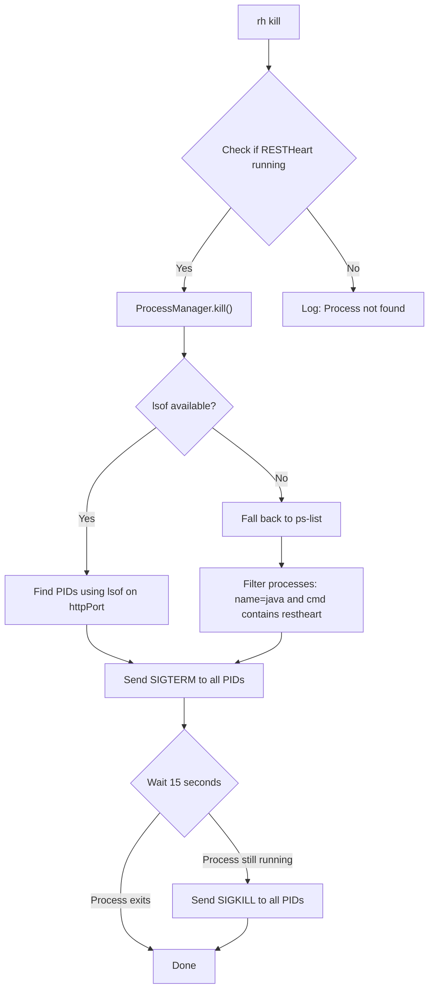
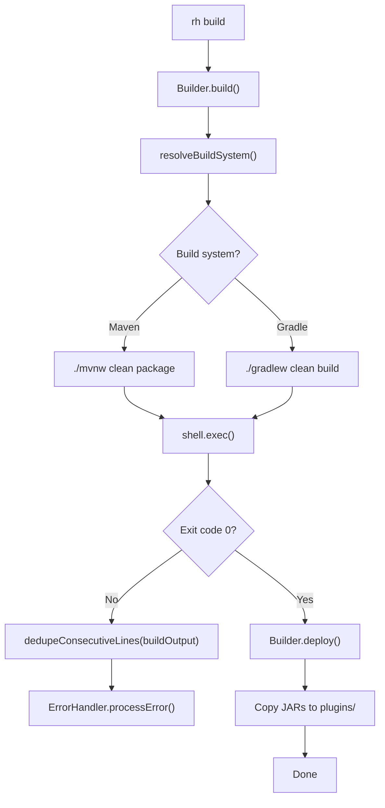
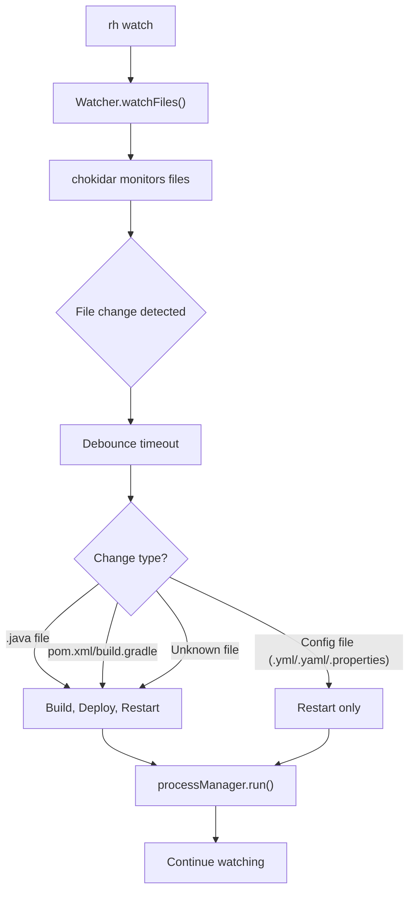

# RESTHeart CLI Operations Runbook

This runbook provides troubleshooting procedures, debugging techniques, and operational guidance for common issues with RESTHeart CLI.

## Quick Reference

### Essential Commands

```bash
# Check RESTHeart status
rh status

# View RESTHeart logs
tail -f restheart.log

# Enable debug mode
rh --debug [command]

# Kill RESTHeart
rh kill

# Check port usage
lsof -i :8080
```

### Emergency Procedures

**RESTHeart won't start**:
1. Check logs: `tail -f restheart.log`
2. Verify Java: `java --version`
3. Check port: `lsof -i :8080`
4. Kill existing: `rh kill`
5. Try standalone: `rh run -- -s`

**Kill Process Flow**:



Figure: RESTHeart graceful kill sequence with SIGTERM timeout and SIGKILL fallback

**Build fails**:
1. Check build output
2. Verify build system: `rh build --build-system maven`
3. Clean cache: `rm -rf .cache`
4. Reinstall: `rh install --force`

## Common Issues

### 1. RESTHeart Fails to Start

**Symptoms**:
- `rh run` exits immediately
- Error messages in terminal
- No response on HTTP port

**Diagnostic Steps**:

```bash
# 1. Check RESTHeart logs
tail -f restheart.log

# 2. Verify Java installation
java --version
# Should show JDK 21+

# 3. Check if port is in use
lsof -i :8080
# Also check JDWP port (httpPort + 1000)
lsof -i :9080

# 4. Verify RESTHeart installation
ls -la .cache/restheart/restheart.jar

# 5. Test RESTHeart directly
java -jar .cache/restheart/restheart.jar -v
```

**Common Causes & Solutions**:

**Port already in use**:
```bash
# Find process using port
lsof -i :8080

# Kill process
kill -9 <PID>

# Or use rh kill
rh kill
```

**Java version too old**:
```bash
# Check version
java --version

# Install JDK 21+ if needed
# macOS: brew install openjdk@21
# Ubuntu: sudo apt install openjdk-21-jdk
```

**MongoDB connection failure**:
```bash
# Use standalone mode (no MongoDB)
rh run -- -s

# Or check MongoDB connection
mongosh --eval "db.runCommand({ping:1})"
```

**Missing RESTHeart installation**:
```bash
# Reinstall RESTHeart
rh install --force
```

### 2. Build Failures

**Symptoms**:
- `rh build` fails with errors
- Compilation errors
- Dependency download failures

**Build and Deploy Flow**:



Figure: RESTHeart plugin build and deploy cycle with output deduplication on failure

**Build Output Deduplication**: When a build fails, `Builder.dedupeConsecutiveLines()` removes duplicate consecutive lines from build output before logging, improving readability of error messages (see `lib/builder.js`).

**Diagnostic Steps**:

```bash
# 1. Check build output
rh build

# 2. Verify build system
ls -la pom.xml build.gradle

# 3. Check Java version
java --version

# 4. Check Maven/Gradle
mvn --version
# OR
gradle --version

# 5. Clean and rebuild
rm -rf .cache
rh install --force
rh build
```

**Common Causes & Solutions**:

**Maven not installed**:
```bash
# Install Maven
# macOS: brew install maven
# Ubuntu: sudo apt install maven

# Or use wrapper
./mvnw clean package
```

**Gradle not installed**:
```bash
# Install Gradle
# macOS: brew install gradle
# Ubuntu: sudo apt install gradle

# Or use wrapper
./gradlew clean build
```

**Dependency download failure**:
```bash
# Check network connection
ping repo1.maven.org

# Clear Maven cache
rm -rf ~/.m2/repository

# Clear Gradle cache
rm -rf ~/.gradle/caches

# Retry build
rh build
```

**Compilation errors**:
```bash
# Check Java source version
grep -r "source" pom.xml

# Verify Java compatibility
java --version

# Check for syntax errors
# Review build output carefully
```

### 3. Watch Mode Issues

**Symptoms**:
- File changes not detected
- Excessive rebuilds
- Watch process crashes

**Watch Mode Flow**:



Figure: RESTHeart watch mode file change processing and rebuild logic

**Diagnostic Steps**:

```bash
# 1. Enable debug mode
rh --debug watch

# 2. Check watched paths
# Look for "Watching paths:" in debug output

# 3. Verify file permissions
ls -la src/main/**/*.java

# 4. Check debounce settings
# Look for "Debounce time:" in debug output
```

**Common Causes & Solutions**:

**File changes not detected**:
```bash
# Check if files are in watched paths
# Default: src/main/**/*.java

# Verify file is being saved
ls -la src/main/java/YourPlugin.java

# Increase debounce time
rh watch --debounce-time 2000
```

**Excessive rebuilds**:
```bash
# Increase debounce time
rh watch --debounce-time 3000

# Check for rapid file changes
# IDE auto-save, format-on-save, etc.
```

**Watch process crashes**:
```bash
# Check system resources
top
df -h

# Reduce watched paths
# Edit watcher.js if needed
```

### 4. Installation Issues

**HTTP Redirect Handling**: The installer's `downloadAndExtractRESTHeart()` follows HTTP 301/302 redirects when downloading RESTHeart from GitHub releases. If a redirect occurs, it automatically follows the new URL (see `lib/installer.js`).

**Symptoms**:
- `rh install` fails
- Download errors
- Version not found

**Diagnostic Steps**:

```bash
# 1. Check network connection
ping github.com

# 2. Check disk space
df -h

# 3. Verify permissions
ls -la .cache/

# 4. Check RESTHeart version
rh install 9.4.0
```

**Common Causes & Solutions**:

**Network issues**:
```bash
# Check proxy settings
echo $HTTP_PROXY
echo $HTTPS_PROXY

# Try different version
rh install 9.4.0

# Use local build
rh install ~/restheart/core/target
```

**Disk space issues**:
```bash
# Check disk space
df -h

# Clean cache
rm -rf .cache

# Reinstall
rh install
```

**Permission issues**:
```bash
# Check permissions
ls -la .cache/

# Fix permissions
chmod -R 755 .cache/

# Reinstall
rh install --force
```

### 5. Port Conflicts

**Symptoms**:
- "Port already in use" error
- Cannot start RESTHeart
- Multiple instances running

**Port Checking Logic**:

The CLI checks two ports to determine if RESTHeart is running:
- **httpPort** (default: 8080): Main RESTHeart HTTP port
- **httpPort + 1000** (default: 9080): JDWP debugger port

**Process Detection Logic**: When killing RESTHeart, the CLI prefers `lsof` for port-specific process detection (targeting only processes bound to the configured httpPort). If `lsof` is unavailable or returns nothing, it falls back to `ps-list` filtering by process name `java` and command containing `restheart` (see `lib/process-manager.js`).

```bash
# Check both ports
lsof -i :8080
lsof -i :9080
```

**Diagnostic Steps**:

```bash
# 1. Check port usage
lsof -i :8080
lsof -i :9080

# 2. Check all RESTHeart processes
ps aux | grep restheart

# 3. Check rh status
rh status

# 4. Check debug mode
rh --debug status
# Look for "isRunningOnHttpPort:" and "isRunningOnHttpPortPlus1000:" messages
```

**Common Causes & Solutions**:

**Previous instance still running**:
```bash
# Kill all RESTHeart instances
rh kill

# Or kill specific port
rh kill --port 8080

# Verify
rh status

# If SIGTERM doesn't work, check for SIGKILL fallback
# ProcessManager.kill() waits 15 seconds for SIGTERM,
# then sends SIGKILL if process still running
```

**Other application using port**:
```bash
# Find process
lsof -i :8080

# Kill process
kill -9 <PID>

# Or use different port
rh run --port 9090
```

**Multiple instances**:
```bash
# Kill all instances
pkill -f restheart

# Verify
ps aux | grep restheart

# Start fresh
rh run
```

### 6. Configuration Issues

**Symptoms**:
- Invalid configuration errors
- Missing configuration values
- Configuration not applied

**Diagnostic Steps**:

```bash
# 1. Enable debug mode
rh --debug run

# 2. Check configuration output
# Look for configuration values in debug output

# 3. Verify config file
cat etc/restheart.yml

# 4. Check environment variables
env | grep RHO
```

**Common Causes & Solutions**:

**Invalid port**:
```bash
# Check port value
rh --debug run

# Use valid port (1-65535)
rh run --port 8080
```

**Missing config file**:
```bash
# Check if file exists
ls -la etc/restheart.yml

# Use default config
rh run

# Or specify correct path
rh run -- -o /path/to/config.yml
```

**Environment variable issues**:
```bash
# Check RHO variable
echo $RHO

# Clear and retry
unset RHO
rh run
```

### 7. Performance Issues

**Symptoms**:
- Slow builds
- High CPU usage
- Memory issues

**Diagnostic Steps**:

```bash
# 1. Check system resources
top
df -h

# 2. Monitor build time
time rh build

# 3. Check watch performance
rh --debug watch
```

**Common Causes & Solutions**:

**Slow builds**:
```bash
# Skip tests with run --build (uses skipTests=true internally)
rh run --build

# Use faster build system
rh build --build-system gradle

# Incremental builds (build system dependent)
```

**High CPU usage**:
```bash
# Increase debounce time
rh watch --debounce-time 3000

# Reduce watched paths
# Edit watcher.js if needed
```

**Memory issues**:
```bash
# Check Java memory settings
java -XX:+PrintFlagsFinal -version | grep HeapSize

# Increase Java heap
export JAVA_OPTS="-Xmx2g"
rh run
```

## Debugging Techniques

### 1. Enable Debug Mode

```bash
# Debug specific command
rh --debug run
rh --debug build
rh --debug watch

# Debug with verbose output
rh --debug --verbose run
```

**Debug Output Includes**:
- Configuration values
- File paths
- Command execution
- Process information
- Error details

### 2. Check RESTHeart Logs

```bash
# View logs in real-time
tail -f restheart.log

# Search for errors
grep -i error restheart.log

# Search for warnings
grep -i warn restheart.log

# View last 50 lines
tail -50 restheart.log
```

**Log Locations**:
- `restheart.log`: Main RESTHeart log (written to repository root by `ProcessManager.run()`)
- Console output: Build and CLI output

**Log Analysis Guidance**: When RESTHeart fails to start, the CLI automatically shows the last 1000 characters from `restheart.log` to help diagnose startup issues (see `lib/process-manager.js`). Use `tail -f restheart.log` for real-time monitoring.

### 3. Monitor System Resources

```bash
# CPU and memory usage
top

# Disk space
df -h

# Network connections
netstat -an | grep 8080

# Process list
ps aux | grep restheart
```

### 4. Test Individual Components

```bash
# Test Java
java --version

# Test Maven
mvn --version

# Test Gradle
gradle --version

# Test RESTHeart
java -jar .cache/restheart/restheart.jar -v

# Test port
lsof -i :8080
```

### 5. Trace Command Execution

```bash
# Enable shell tracing
set -x
rh run
set +x

# Or use strace (Linux)
strace -f rh run
```

## Implementation Details

### Port Checking Logic

The `ProcessManager.isRunning()` method checks both ports to determine if RESTHeart is running:

```javascript
// From lib/process-manager.js
async isRunning() {
    const httpPort = this.configManager.get('httpPort')
    const isRunningOnHttpPort = await checkPort(httpPort)
    const isRunningOnHttpPortPlus1000 = await checkPort(httpPort + 1000)
    return isRunningOnHttpPort || isRunningOnHttpPortPlus1000
}
```

**Key Points**:
- Checks both IPv4 (`127.0.0.1`) and IPv6 (`::1`) addresses
- Uses TCP connection attempts with 2-second timeout
- Returns `true` if either port is accessible
- JDWP port (httpPort + 1000) is used for Java debugging

### Kill Process Logic

The `ProcessManager.kill()` method implements graceful shutdown:

```javascript
// From lib/process-manager.js
async kill() {
    // 1. Find PIDs using lsof (preferred) or ps-list (fallback)
    // 2. Send SIGTERM to all PIDs
    // 3. Wait up to 15 seconds for process to exit
    // 4. If still running, send SIGKILL
}
```

**Key Points**:
- Prefers `lsof` for port-specific process detection
- Falls back to `ps-list` for process discovery
- Uses SIGTERM for graceful shutdown
- Escalates to SIGKILL after 15-second timeout
- Waits for port to be freed before returning

### Watch Mode Implementation

The `Watcher.watchFiles()` method monitors multiple file types:

```javascript
// From lib/watcher.js
watchFiles(restheartOptions, watchOptions) {
    // Default watched paths:
    // - src/main/**/*.java (Java source files)
    // - **/pom.xml (Maven config)
    // - **/build.gradle (Gradle config)
    // - **/build.gradle.kts (Gradle Kotlin DSL)
    // - **/settings.gradle (Gradle settings)
    // - **/settings.gradle.kts (Gradle Kotlin DSL settings)
    // - Config files from -o option
}
```

**Key Points**:
- Uses chokidar for cross-platform file watching
- Implements debouncing (default: 1000ms)
- Distinguishes between Java, build config, and config file changes
- Config file changes trigger restart without rebuild
- Java/build config changes trigger full rebuild cycle

### Build System Resolution

The build system is resolved using `resolveBuildSystem()`:

```javascript
// From lib/build-systems/index.js
function resolveBuildSystem(repoDir, preferred = 'auto') {
    // 1. Check for explicit --build-system option
    // 2. Check for pom.xml or mvnw → Maven
    // 3. Check for gradlew, build.gradle, build.gradle.kts, settings.gradle, settings.gradle.kts → Gradle
    // 4. Default to Maven when neither detected
}
```

**Key Points**:
- Prefers wrapper scripts (`./mvnw`, `./gradlew`) over system commands
- Maven uses `-DskipTests={true|false}` for test skipping
- Gradle uses `-x test` to skip tests
- Build params are mapped: `'package'` → `'build'`, `'clean package'` → `'clean build'`

## Operational Procedures

### 1. Clean Installation

```bash
# 1. Remove cache
rm -rf .cache

# 2. Reinstall RESTHeart
rh install

# 3. Verify installation
java -jar .cache/restheart/restheart.jar -v

# 4. Build and run
rh build
rh run
```

### 2. Version Upgrade

```bash
# 1. Check current version
rh --version

# 2. Update CLI
npm update -g @softinstigate/rh

# 3. Update RESTHeart
rh install latest

# 4. Rebuild plugins
rh build

# 5. Test
rh run
```

### 3. Cache Cleanup

```bash
# 1. Stop RESTHeart
rh kill

# 2. Remove cache
rm -rf .cache

# 3. Reinstall
rh install

# 4. Rebuild
rh build
```

### 4. Port Change

```bash
# 1. Stop current instance
rh kill

# 2. Start on new port
rh run --port 9090

# 3. Verify
rh status --port 9090
```

### 5. Build System Switch

```bash
# 1. Stop RESTHeart
rh kill

# 2. Clean build artifacts
rm -rf target/
rm -rf build/

# 3. Build with new system
rh build --build-system gradle

# 4. Run
rh run
```

## Maintenance Tasks

### 1. Regular Health Check

```bash
# Check status
rh status

# Check logs for errors
grep -i error restheart.log

# Check disk space
df -h

# Check Java version
java --version
```

### 2. Log Rotation

```bash
# Backup current log
cp restheart.log restheart.log.backup

# Clear log
> restheart.log

# Or configure log rotation in RESTHeart config
```

### 3. Dependency Updates

```bash
# Update CLI dependencies
cd restheart-cli
npm update

# Update project dependencies
# Maven: mvn versions:display-dependency-updates
# Gradle: gradle dependencyUpdates
```

### 4. Security Updates

```bash
# Check for security vulnerabilities
npm audit

# Fix vulnerabilities
npm audit fix

# Update dependencies
npm update
```

## Error Messages Reference

### Common Error Messages

**"Port 8080 already in use"**:
- **Cause**: Another process using port 8080
- **Solution**: `rh kill` or `rh run --port 9090`

**"Java not found"**:
- **Cause**: Java not installed or not in PATH
- **Solution**: Install JDK 21+ and add to PATH

**"Build failed"**:
- **Cause**: Compilation or dependency error
- **Solution**: Check build output, verify build system

**"RESTHeart not installed"**:
- **Cause**: Missing RESTHeart installation
- **Solution**: `rh install`

**"Invalid configuration"**:
- **Cause**: Invalid config values
- **Solution**: Check config file, use debug mode

**"MongoDB connection failed"**:
- **Cause**: Cannot connect to MongoDB
- **Solution**: Use standalone mode (`-s`) or check MongoDB

### Error Code Reference

**Exit Code 0**: Success
**Exit Code 1**: General error
**Exit Code 2**: Misuse of command
**Exit Code 126**: Permission denied
**Exit Code 127**: Command not found

### ErrorHandler Error Types

The CLI uses centralized error handling with specific error types:

- **commandNotFound**: Command or tool not installed (e.g., `java`, `mvn`)
- **configError**: Invalid configuration values (port, build system, etc.)
- **networkError**: Download failures, connection issues, timeouts
- **processError**: Build failures, process crashes, runtime errors
- **fileSystemError**: Permission issues, missing files, directory creation failures

**Diagnosing by error type**:
```bash
# commandNotFound errors
# Check if required tools are installed
java --version
mvn --version
gradle --version

# configError errors
# Check configuration values
rh --debug run
# Look for "Invalid port" or "Invalid build system" messages

# networkError errors
# Check network connectivity
ping github.com
ping repo1.maven.org

# processError errors
# Check build output and logs
tail -f restheart.log

# fileSystemError errors
# Check permissions and disk space
df -h
ls -la .cache/
```

## Prevention Best Practices

### 1. Regular Maintenance

- Keep CLI updated: `npm update -g @softinstigate/rh`
- Keep RESTHeart updated: `rh install latest`
- Monitor logs regularly
- Check disk space

### 2. Version Management

- Pin RESTHeart version for production
- Test upgrades in development first
- Document version requirements

### 3. Configuration Management

- Use version control for config files
- Document custom configurations
- Use environment variables for secrets

### 4. Backup Procedures

- Backup RESTHeart configuration
- Backup plugin source code
- Document build procedures

## Related Documentation

- **Architecture Overview**: [../architecture/overview.md](../architecture/overview.md)
- **Domain Concepts**: [../domain/concepts.md](../domain/concepts.md)
- **Testing Guidance**: [../testing/guidance.md](../testing/guidance.md)

## Escalation Procedures

### Level 1: Self-Service

- Check this runbook
- Review logs
- Try basic troubleshooting

### Level 2: Community Support

- Search GitHub issues
- Ask on community forums
- Check RESTHeart documentation

### Level 3: Professional Support

- Contact SoftInstigate support
- Provide detailed error information
- Include logs and configuration

## Contact Information

**RESTHeart CLI Issues**:
- GitHub: [github.com/SoftInstigate/restheart-cli](https://github.com/SoftInstigate/restheart-cli)
- Issues: [GitHub Issues](https://github.com/SoftInstigate/restheart-cli/issues)

**RESTHeart Documentation**:
- Official: [restheart.org/docs](https://restheart.org/docs)
- Plugins: [restheart.org/docs/plugins/overview](https://restheart.org/docs/plugins/overview)

**Community**:
- GitHub Discussions
- Stack Overflow (tag: restheart)

---

*This runbook is maintained alongside the codebase. For architectural context, see the [Architecture Overview](../architecture/overview.md). For development workflows, see [Development Workflows](../workflows/development-workflow.md).*
